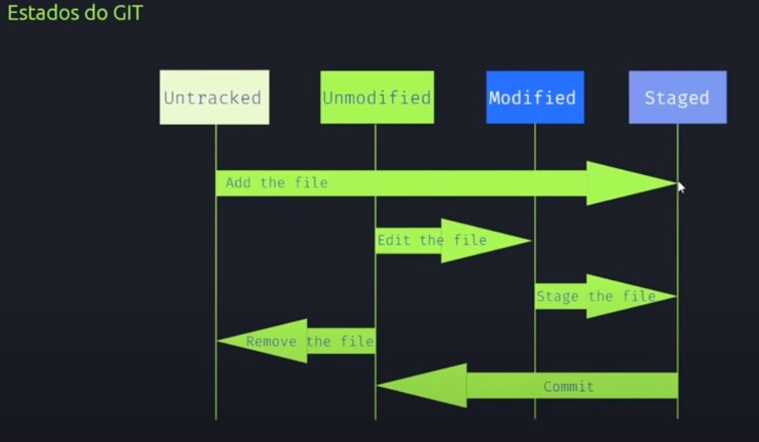
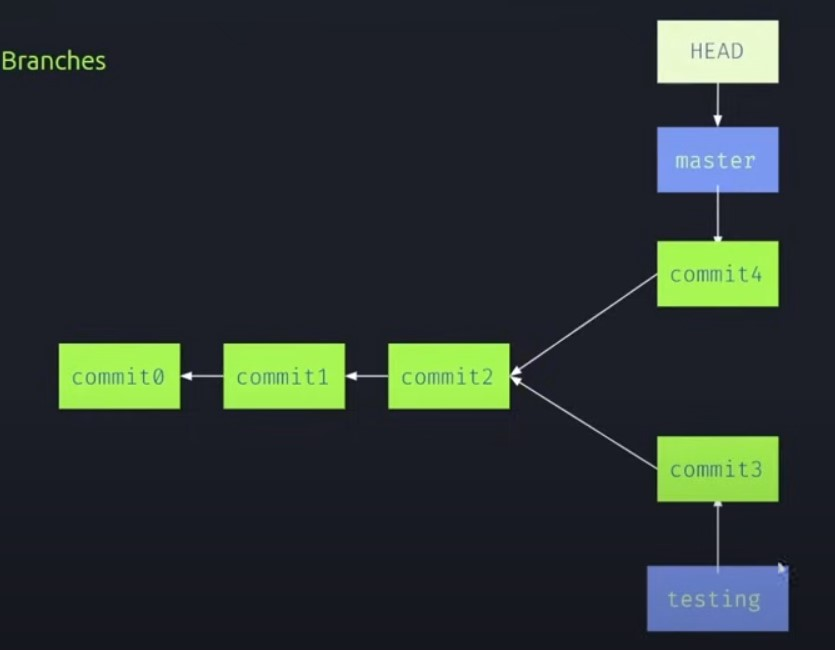
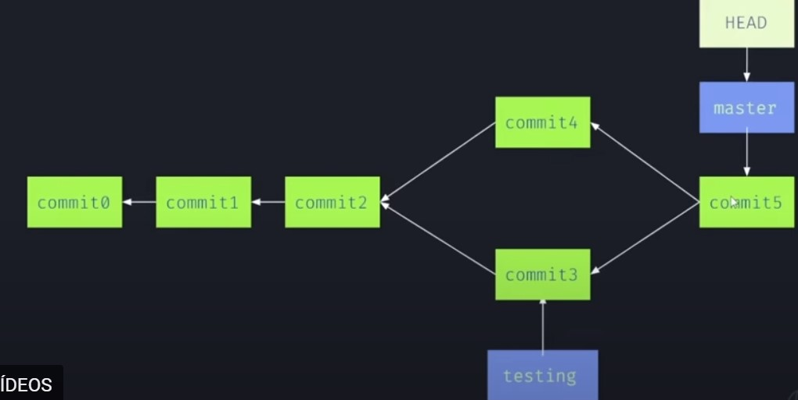

# Curso Git Versionamento 

> Aprendendo git e github

- O que é "Unmodified" no Git?

No Git, "unmodified" (não modificado) refere-se ao estado de um arquivo em um repositório Git quando o arquivo não foi alterado desde o último commit.

- O que é "Modified" no Git?

"Modified" (modificado) no contexto do Git refere-se ao estado de um arquivo em um repositório Git quando o arquivo foi alterado desde o último commit. Quando você faz mudanças em um arquivo que já está no repositório e ainda não fez commit dessas alterações, o estado do arquivo é marcado como "modified".

- O que é "Staged " no Git? 

No contexto do Git, "staged" (ou "preparado") refere-se ao estado dos arquivos que foram marcados para serem incluídos no próximo commit. Quando você faz alterações em um arquivo no seu repositório Git e decide que deseja que essas alterações façam parte do próximo commit, você precisa primeiro "adicionar" ou "preparar" essas mudanças. Esse processo é conhecido como staging.

Para stagear alterações em um arquivo, você utiliza o comando git add. Quando você executa git add para um arquivo modificado, ele é marcado como "staged". Após ter stageado todas as mudanças que você deseja incluir no próximo commit, você pode criar um novo commit usando o comando git commit. As alterações stageadas serão então registradas no repositório como parte desse novo commit. 

## Comados Git

### 1- CRIAR O DIRETÓRIO (PASTA) 
- `git init` // inicializa o Git

### 2 - Configurar o Gitbash 
- `git config --global user.name` // mostra o usuário logado
- `git config --global user.email` // mostra o email logado
- `git config --global user.name "seu_nome"`
- `git config --global user.email seuemail@dominio.com`

### 3 - Manipulação de arquivos 
- `git status` // fornece informações sobre a branch atual, incluindo se está atualizada em relação à master e quais arquivos foram alterados.
- `git add .` // adiciona todos os arquivos
- `git add exemplo.txt` // adiciona um arquivo específico
- `git commit -m "primeira versão"` // envia a versão (versiona)

#### Mostra o histórico de todos os commits feitos
- `git log` // verifica os versionamentos
- `git show` // mostra o que foi alterado no seu versionamento

## Git diff
- `git diff` // mostra a diferença das linhas que foram alteradas e adicionadas (em vermelho linhas alteradas e em verde linhas adicionadas)
- `git diff --staged` // mostra modificações feitas na área de staged
- `reflog` // verifica o histórico de atualizações 

## RESTORE

- `git restore <nome-do-arquivo>` // retorna para o estado unmodified (não modificado)
- `git restore --staged <nome-do-arquivo>` // remove alterações na área de staged 
- `git reset --hard <ID>` // navegar entre versões locais

## Enviar para o GitHub 
- `git remote <nome-do-repositório>`
- `git push` // envia para a nuvem
- `git pull` // junta o seu repositório local com o do GitHub 

#### Boas práticas para junção de repositório da nuvem com repositório local

- `git fetch` // traz todas as modificações da nuvem para o repositório local sem juntar 
- `git diff origin/master` 
- `git pull` // junta as modificações do repositório local com o do GitHub

- `git checkout` <nome-branch> // muda de branch 

### 1. **Criar um Branch:**

Em Git, um branch é uma ramificação do código-fonte, permitindo que você trabalhe em diferentes partes de um projeto simultaneamente sem interferir no código principal. Para criar um novo branch, você usa o seguinte comando:
- `git branch` // mostra todas as banch que existem 
- `git branch` <nome-branch> //Cria uma branch 
- `git log` --oneline --decorate  // INDICA onde está com HEAD

### 2. **Mudar para um Branch:**

Após criar um branch, você precisa mudar para ele para começar a trabalhar nele. Use o comando `git checkout` para fazer isso:

`git checkout` <nome-do-branch>

#### Marge 

git merge <nome-da-banch> // Acontece uma junção da branch atual com na branch indicada no merge 

